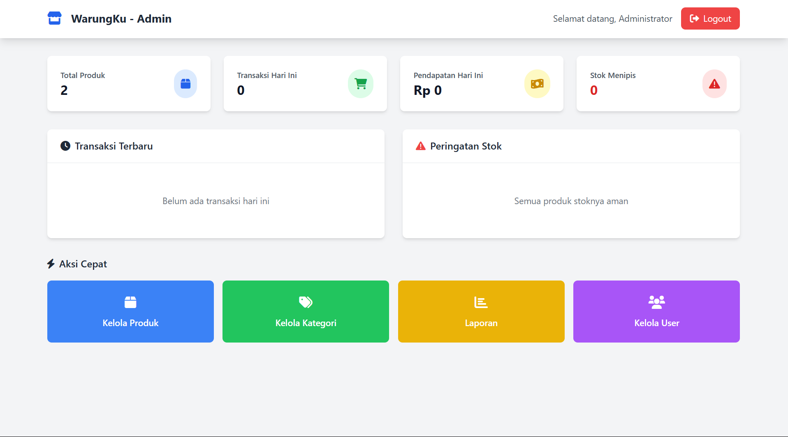

# Warungku 
WarungKu adalah sistem kasir berbasis web yang dirancang untuk memudahkan pengelolaan transaksi penjualan di toko kecil atau warung. Sistem ini mengimplementasikan konsep database tingkat lanjut seperti TRANSACTION, FUNCTION, STORED PROCEDURE, dan TRIGGER untuk memastikan data yang konsisten, otomatis, dan aman.

Dengan fitur login berbasis peran (Admin & Kasir), dashboard real-time, serta antarmuka UI yang user-friendly, WarungKu mendukung proses penjualan yang cepat dan akurat. Transaksi difasilitasi dengan kalkulasi otomatis (subtotal, diskon, pajak, kembalian) dan cetak struk otomatis.



## 📌 Detail Konsep


### 🧠 Stored Procedure 
Stored procedure dalam WarungKu digunakan untuk menyederhanakan dan mengotomatisasi proses-proses penting di database, terutama yang bersifat berulang dan kompleks. Dengan stored procedure, pemrosesan data menjadi lebih efisien, terstruktur, dan mudah dipanggil dari aplikasi.


### 📂 Lokasi: `database/procedures.sql`

Berikut adalah daftar Stored Procedure yang diimplementasikan:

---

###  1. `tambah_produk()`

Menambahkan produk baru ke dalam tabel `produk`.

```sql
DELIMITER //
CREATE PROCEDURE tambah_produk(
    IN p_kode VARCHAR(20),
    IN p_nama VARCHAR(100),
    IN p_kategori INT,
    IN p_harga DECIMAL(10,2),
    IN p_stok INT,
    IN p_stok_min INT,
    IN p_status VARCHAR(10),
    IN p_foto VARCHAR(255)
)
BEGIN
    INSERT INTO produk (kode_produk, nama_produk, id_kategori, harga_jual, stok, stok_minimum, status, foto_produk)
    VALUES (p_kode, p_nama, p_kategori, p_harga, p_stok, p_stok_min, p_status, p_foto);
END //
DELIMITER ;
```

Penggunaan di PHP:

```sql
// admin/produk-tambah.php
$query = "CALL tambah_produk('$kode_produk', '$nama_produk', $id_kategori, $harga_jual, $stok, $stok_minimum, '$status', " . ($foto_produk ? "'$foto_produk'" : "NULL") . ")";
```


###  2. `update_produk()`

Memperbarui data produk berdasarkan ID. Jika `foto_produk` tidak disediakan, maka kolom foto tidak diubah.

```sql
DELIMITER //
CREATE PROCEDURE update_produk(
    IN p_id INT,
    IN p_kode VARCHAR(20),
    IN p_nama VARCHAR(100),
    IN p_kategori INT,
    IN p_harga DECIMAL(10,2),
    IN p_stok INT,
    IN p_stok_min INT,
    IN p_status VARCHAR(10),
    IN p_foto VARCHAR(255)
)
BEGIN
    IF p_foto IS NOT NULL THEN
        UPDATE produk 
        SET kode_produk = p_kode,
            nama_produk = p_nama,
            id_kategori = p_kategori,
            harga_jual = p_harga,
            stok = p_stok,
            stok_minimum = p_stok_min,
            status = p_status,
            foto_produk = p_foto
        WHERE id_produk = p_id;
    ELSE
        UPDATE produk 
        SET kode_produk = p_kode,
            nama_produk = p_nama,
            id_kategori = p_kategori,
            harga_jual = p_harga,
            stok = p_stok,
            stok_minimum = p_stok_min,
            status = p_status
        WHERE id_produk = p_id;
    END IF;
END //
DELIMITER ;
```

Penggunaan di PHP:

```sql
// admin/produk-edit.php
$query = "CALL update_produk($id_produk, '$kode_produk', '$nama_produk', $id_kategori, $harga_jual, $stok, $stok_minimum, '$status', " . ($foto_produk ? "'$foto_produk'" : "NULL") . ")";

```

###  3. `laporan_penjualan_harian()`

Menghasilkan laporan penjualan harian berdasarkan tanggal tertentu.

```sql
DELIMITER //
CREATE PROCEDURE laporan_penjualan_harian(IN p_tanggal DATE)
BEGIN
    SELECT 
        p.nama_produk,
        SUM(dt.jumlah) AS total_terjual,
        SUM(dt.subtotal) AS total_pendapatan,
        p.stok AS stok_tersisa
    FROM detail_transaksi dt
    JOIN produk p ON dt.id_produk = p.id_produk
    JOIN transaksi t ON dt.id_transaksi = t.id_transaksi
    WHERE DATE(t.tanggal_transaksi) = p_tanggal
      AND t.status = 'selesai'
    GROUP BY p.id_produk
    ORDER BY total_pendapatan DESC;
END //
DELIMITER ;
```

Penggunaan di PHP:
```sql
// laporan/harian.php
$query = "CALL laporan_penjualan_harian('2024-12-10')";

```

###  4. `get_produk_by_kategori()`

Mengambil daftar produk berdasarkan kategori tertentu.

```sql
DELIMITER //
CREATE PROCEDURE get_produk_by_kategori(IN p_id_kategori INT)
BEGIN
    SELECT p.*, k.nama_kategori
    FROM produk p
    JOIN kategori k ON p.id_kategori = k.id_kategori
    WHERE p.id_kategori = p_id_kategori AND p.status = 'aktif'
    ORDER BY p.nama_produk;
END //
DELIMITER ;
```

Penggunaan di PHP:
```sql
// kasir/produk.php
$query = "CALL get_produk_by_kategori($id_kategori)";

```

## 🔁 Triggers

Trigger dalam **WarungKu** digunakan untuk menjalankan aksi otomatis saat terjadi perubahan data tertentu, seperti transaksi penjualan atau update stok. Dengan trigger, sistem dapat menjaga konsistensi data, memberikan notifikasi otomatis, dan menghindari kelalaian manusia.


---

### 📂 Lokasi: `database/triggers_update.sql`

Berikut adalah daftar trigger yang telah diimplementasikan:

---

###  1. `update_stok_after_sale_v2`

Mengurangi stok produk dan mencatat log setiap kali terjadi transaksi penjualan.

```sql
DELIMITER //
CREATE TRIGGER update_stok_after_sale_v2
AFTER INSERT ON detail_transaksi
FOR EACH ROW
BEGIN
    DECLARE stok_lama INT;
    DECLARE nama_produk_var VARCHAR(100);
    
    -- Ambil stok sebelumnya dan nama produk
    SELECT stok, nama_produk INTO stok_lama, nama_produk_var 
    FROM produk WHERE id_produk = NEW.id_produk;
    
    -- Update stok produk
    UPDATE produk 
    SET stok = stok - NEW.jumlah 
    WHERE id_produk = NEW.id_produk;
    
    -- Log perubahan stok
    INSERT INTO log_stok (id_produk, tipe, jumlah, stok_sebelum, stok_sesudah, keterangan)
    VALUES (
        NEW.id_produk, 
        'keluar', 
        NEW.jumlah, 
        stok_lama, 
        stok_lama - NEW.jumlah,
        CONCAT('Penjualan - Transaksi: ', NEW.id_transaksi, ' - Produk: ', nama_produk_var)
    );
END //
DELIMITER ;
```
###  2. `update_stok_after_sale_v2`

Memberikan notifikasi otomatis jika stok menipis atau habis.

```sql
DELIMITER //
CREATE TRIGGER alert_stok_menipis_v2
AFTER UPDATE ON produk
FOR EACH ROW
BEGIN
    -- Alert jika stok mencapai batas minimum
    IF NEW.stok <= NEW.stok_minimum AND OLD.stok > NEW.stok_minimum THEN
        INSERT INTO notifikasi (pesan, tipe)
        VALUES (
            CONCAT('PERINGATAN: Stok produk "', NEW.nama_produk, '" tinggal ', NEW.stok, ' unit (minimum: ', NEW.stok_minimum, ')'),
            'warning'
        );
    END IF;
    
    -- Alert jika stok habis
    IF NEW.stok = 0 AND OLD.stok > 0 THEN
        INSERT INTO notifikasi (pesan, tipe)
        VALUES (
            CONCAT('HABIS: Stok produk "', NEW.nama_produk, '" sudah habis!'),
            'error'
        );
    END IF;
END //
DELIMITER ;
```
###  3. `update_total_item_v2`

Menghitung total item dalam satu transaksi setelah detail ditambahkan.

```sql
DELIMITER //
CREATE TRIGGER update_total_item_v2
AFTER INSERT ON detail_transaksi
FOR EACH ROW
BEGIN
    DECLARE total_items INT;
    
    -- Hitung total item untuk transaksi ini
    SELECT SUM(jumlah) INTO total_items
    FROM detail_transaksi 
    WHERE id_transaksi = NEW.id_transaksi;
    
    -- Update header transaksi
    UPDATE transaksi 
    SET total_item = total_items
    WHERE id_transaksi = NEW.id_transaksi;
END //
DELIMITER ;
```

Beberapa peran trigger di sistem ini:
* Mengurangi stok produk secara otomatis setelah penjualan dilakukan.
* Mencatat riwayat perubahan stok ke tabel log_stok untuk keperluan audit.
* Memberikan notifikasi otomatis saat stok menipis atau habis.
* Menyinkronkan total item di transaksi utama setelah detail ditambahkan.

Dengan adanya trigger di lapisan database, integritas dan konsistensi data tetap terjaga secara otomatis, meskipun terdapat celah atau kesalahan dari sisi aplikasi. Hal ini mendukung prinsip data consistency dan resilience dalam sistem yang andal.


## 🔄 TRANSACTION 

Transaksi digunakan untuk menjamin integritas data saat proses pembelian dilakukan. Dengan menerapkan prinsip **ACID**, sistem WarungKu memastikan bahwa seluruh langkah transaksi bersifat atomik dan aman dari inkonsistensi.

### 📂 Lokasi: `kasir/proses_transaksi.php`
---

###  Konsep Dasar

```php
// IMPLEMENTASI TRANSACTION
mysqli_autocommit($conn, false); // Nonaktifkan autocommit

try {
    mysqli_begin_transaction($conn); // Mulai transaksi

    // ... berbagai operasi database ...

    mysqli_commit($conn); // Komit jika semua berhasil
} catch (Exception $e) {
    mysqli_rollback($conn); // Rollback jika gagal
}

mysqli_autocommit($conn, true); // Aktifkan kembali autocommit
```

**Detail Penerapan:**

1. **ACID Properties yang Dipenuhi:**

| Properti        | Penjelasan                                                                   |
| --------------- | ---------------------------------------------------------------------------- |
| **Atomicity**   | Semua langkah dalam transaksi berhasil seluruhnya atau dibatalkan sepenuhnya |
| **Consistency** | Data tetap valid sebelum dan sesudah transaksi                               |
| **Isolation**   | Transaksi tidak saling mengganggu antar proses yang berjalan bersamaan       |
| **Durability**  | Perubahan tersimpan permanen setelah transaksi dikomit                       |


2. **Langkah-langkah dalam Transaksi:**

```sql
// 1. Generate nomor transaksi menggunakan FUNCTION
$no_transaksi_query = "SELECT generate_no_transaksi() as no_transaksi";

// 2. Validasi stok untuk semua item menggunakan FUNCTION
foreach ($input['items'] as $item) {
    $stok_check = "SELECT cek_stok_tersedia({$item['id']}, {$item['qty']}) as status";
    // Jika stok tidak cukup, throw Exception untuk ROLLBACK
}

// 3. Hitung pajak menggunakan FUNCTION
$pajak_query = "SELECT hitung_pajak({$input['subtotal']}, $diskon_nominal) as pajak";

// 4. Insert header transaksi
$insert_transaksi = "INSERT INTO transaksi (...)";

// 5. Insert detail transaksi (trigger otomatis update stok)
foreach ($input['items'] as $item) {
    $insert_detail = "INSERT INTO detail_transaksi (...)";
}
```
3. **Keuntungan Implementasi:**

🔄 Rollback otomatis jika terjadi error

🔒 Perlindungan stok dari pengurangan yang tidak valid

🧩 Konsistensi data antara header & detail terjaga

⚙️ Validasi menyeluruh dengan kombinasi stored function dan trigger


## 🧠 FUNCTION 

Beberapa function disiapkan di level database untuk memastikan proses perhitungan dan validasi berjalan konsisten, efisien, dan reusable di berbagai bagian sistem.

### 📂 Lokasi: `database/functions.sql`

---

###  1. `generate_no_transaksi()`

```sql
CREATE FUNCTION generate_no_transaksi()
RETURNS VARCHAR(20)
BEGIN
    DECLARE no_urut INT;
    DECLARE hasil VARCHAR(20);
    
    SELECT COALESCE(MAX(CAST(SUBSTRING(no_transaksi, 9) AS UNSIGNED)), 0) + 1 
    INTO no_urut
    FROM transaksi 
    WHERE DATE(tanggal_transaksi) = CURDATE();
    
    SET hasil = CONCAT('TRX', DATE_FORMAT(NOW(), '%y%m%d'), LPAD(no_urut, 3, '0'));
    RETURN hasil;
END
```
**Penjelasan:**

- **Tujuan**: Generate nomor transaksi otomatis dengan format TRXyymmddnnn
- **Logic**: Ambil nomor urut terakhir hari ini, tambah 1
- **Contoh Output**: TRX2412100001, TRX2412100002, dst.

###  2. `hitung_pajak(subtotal, diskon)`

```sql
CREATE FUNCTION hitung_pajak(subtotal DECIMAL(10,2), diskon DECIMAL(10,2))
RETURNS DECIMAL(10,2)
BEGIN
    RETURN (subtotal - diskon) * 0.10;
END
```

**Penjelasan:**

- **Tujuan**: Hitung pajak 10% dari subtotal setelah diskon
- **Logic**: (Subtotal - Diskon) × 10%
- **Penggunaan**: Dipanggil dalam transaksi untuk konsistensi perhitungan

###  3. `cek_stok_tersedia(id_produk, jumlah)`

```sql
CREATE FUNCTION cek_stok_tersedia(p_id_produk INT, p_jumlah INT)
RETURNS VARCHAR(20)
BEGIN
    DECLARE stok_sekarang INT;
    SELECT stok INTO stok_sekarang FROM produk WHERE id_produk = p_id_produk;

    IF stok_sekarang >= p_jumlah THEN
        RETURN 'TERSEDIA';
    ELSE
        RETURN 'TIDAK_CUKUP';
    END IF;
END
```

**Penjelasan:**

- **Tujuan**: Validasi ketersediaan stok sebelum penjualan
- **Logic**: Bandingkan stok tersedia dengan jumlah yang diminta
- **Return**: 'TERSEDIA' atau 'TIDAK_CUKUP'

###  4. `format_rupiah(nominal)`

```sql
CREATE FUNCTION format_rupiah(nominal DECIMAL(10,2))
RETURNS VARCHAR(50)
BEGIN
    RETURN CONCAT('Rp ', FORMAT(nominal, 0));
END
```

**Penjelasan:**

- **Tujuan**: Format angka menjadi format rupiah
- **Logic**: Tambahkan prefix "Rp " dan format dengan pemisah ribuan
- **Contoh**: 15000 → "Rp 15,000"

## 🧩 Relevansi Proyek dengan Pemrosesan Data Terdistribusi

Sistem ini dirancang dengan menerapkan prinsip-prinsip penting dalam pemrosesan data terdistribusi, yaitu:

- **Konsistensi**  
  Fungsi-fungsi seperti `hitung_pajak`, `generate_no_transaksi`, dan `cek_stok_tersedia` memastikan seluruh proses perhitungan dan validasi dilakukan secara konsisten langsung di tingkat database. Hal ini mencegah inkonsistensi data meskipun proses dipanggil dari berbagai sumber.

- **Reliabilitas**  
  Penerapan `TRANSACTION` dan `TRIGGER` menjamin bahwa data akan tetap aman walaupun terjadi error atau interupsi dalam proses transaksi. Semua perubahan akan dibatalkan jika ada satu langkah yang gagal.

- **Integritas**  
  Dengan menyimpan seluruh logika penting di dalam stored procedure, function, dan trigger, sistem menjaga validitas data tanpa bergantung pada sisi frontend atau aplikasi. Ini sangat penting untuk memastikan data tetap sah dalam skenario multi-client seperti web, mobile, atau API.
